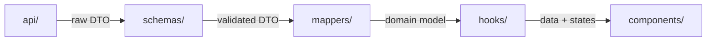

# Feature-based architecture

> [!abstract] The pattern
> Each business feature (`auth`, `profile`, `dashboard`, ...) is a self-contained folder under `src/features/`, with the same internal layers every time — instead of scattering hooks/types/components into global folders shared across the whole app.

Related: [[Auth feature]] · [[Profile feature]] · [[Dashboard feature]] · [[React Query]] · [[Next.js middleware]] · [[Next.js]] · [[Project structure]]

---

## The standard layer set

```
src/features/<feature-name>/
├── api/          # raw network calls — the only place that knows the real endpoint URLs
├── hooks/        # useQuery/useMutation wrapping api/ — the only place components talk to
├── mappers/      # DTO (raw API shape) <-> domain model, both directions
├── schemas/      # Zod validation for API responses/requests
├── types/        # dummy-*.ts (raw DTOs) + <feature>.ts (domain types)
├── lib/          # feature-local helpers: query-keys.ts, formatters, style maps
├── data/         # mock data (temporary, until a real endpoint exists — see Dashboard feature)
└── components/   # UI, only ever imports from hooks/ and types/, never api/ directly
```

---

## The data flow every feature follows



> [!tip] Why this matters for API integration specifically
> If the backend renames a field or changes a response shape, only `api/`, `schemas/`, and `mappers/` change. Components and hooks never know or care — they only ever see the domain type in `types/<feature>.ts`.

---

## Why colocate instead of centralize

Next.js's default instinct is a global `types/`, `hooks/`, `lib/` per app. Feature folders instead keep everything about "auth" together:

- Onboarding: someone can learn one feature without touring the whole codebase
- Deletion/refactor: remove a feature without hunting for its pieces across the app
- Naming collisions avoided: `useProfile` vs `useUser` vs `useSettings`, each scoped to its own folder

---

## When cross-feature imports are okay

> [!question] Profile feature imports from Auth feature's role mapper
> ```typescript
> import { mapApiRoleToAppRole } from "@/features/auth/mappers/role.mapper";
> ```
> This is fine for something as fundamental as roles — duplicating the mapping table in two places would be worse. But if cross-imports multiply across many features, that's the signal to extract shared concepts into a `src/shared/` or `src/entities/` layer both features import from, rather than importing directly from each other.

---

## Not every feature needs every layer

[[Dashboard feature]] has a `data/` folder (mock data) instead of a fully wired `api/` hitting a real endpoint — because no real backend exists yet for invoices. The layers are a **menu, not a mandate**: use what the feature's current maturity actually needs, and let the shape grow toward the full pattern as the backend catches up.

---

## See also
- [[Auth feature]] · [[Profile feature]] · [[Dashboard feature]] — three real implementations of this pattern
- [[React Query]] — what lives in every feature's `hooks/` folder
- [[Next.js middleware]] — a layer that sits *above* all features, reading cookies any feature's login flow sets
- [[Project structure]] — the top-level view of how `features/` fits alongside `app/`, `config/`, and `middleware.ts`
- [[Next.js]] — the framework this whole layout is built on top of
