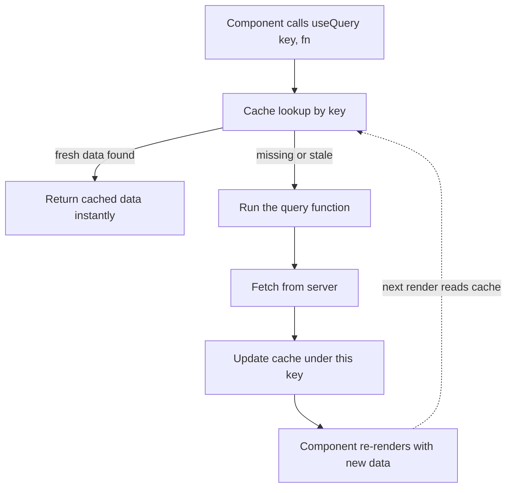

# React Query (TanStack Query)

> [!abstract] One-line definition
> A client-side cache manager for async server data. Not a fetch wrapper — a **shelf system** that remembers what it fetched, how fresh it is, and re-fetches automatically when needed.

Related: [[Next.js]] · [[Zod]] · [[Feature-based architecture]] · [[Auth feature]] · [[Profile feature]] · [[Dashboard feature]]

---

## Why it exists

> [!question] The problem it solves
> Without it, every component tracks its own `data` / `isLoading` / `error` via `useState` + `useEffect`. Two components needing the same data fetch it **twice**, with zero sharing.

```typescript
// The "before" pattern — repeated in every component that needs server data
const [data, setData] = useState(null);
const [isLoading, setIsLoading] = useState(true);
const [error, setError] = useState(null);

useEffect(() => {
  fetchProfile().then(setData).catch(setError).finally(() => setIsLoading(false));
}, []);
```

React Query replaces this with one declarative call, backed by a shared cache.

---

## Core concepts

### 1. The Query Key — *the address on the shelf*

The key is how React Query identifies "is this the same data or different data."

```typescript
useQuery({
  queryKey: ["profile", 1], // <- unique address for user id 1's profile
  ...
});
```

> [!tip] Centralize keys, don't inline them
> A typo'd key (`["profil", 1]`) silently creates a **new, disconnected** cache entry instead of erroring. That's why every feature here has its own `lib/query-keys.ts`:

```typescript
// src/features/profile/lib/query-keys.ts
export const profileKeys = {
  all: ["profile"] as const,
  detail: (id: number) => [...profileKeys.all, id] as const,
};

// src/features/auth/lib/query-keys.ts
export const authKeys = {
  all: ["auth"] as const,
  currentUser: () => [...authKeys.all, "me"] as const,
};
```

---

### 2. The Query Function — *how to get it if it's not on the shelf*

Just your normal async fetch logic — but you never call it directly. You hand it to React Query and it decides *when* to run it.

```typescript
// src/features/profile/hooks/use-profile.ts
export function useProfile(userId: number) {
  return useQuery<UserProfile>({
    queryKey: profileKeys.detail(userId),
    queryFn: async () => {
      const dto = await fetchProfileById(userId);
      return mapToUserProfile(dto);
    },
    staleTime: 60 * 1000,
  });
}
```

> [!note] `staleTime`
> Controls how long cached data is considered "fresh enough to skip refetching." `60 * 1000` = 1 minute. After that, the next mount/focus triggers a silent background refetch.

---

### 3. Query States — *free status flags*

| Flag | Beginner meaning |
|---|---|
| `isPending` | Nothing in the cache yet — first-ever load |
| `isFetching` | A request is in flight *right now* (even a background refetch) |
| `isSuccess` | `data` is populated |
| `isError` | The query function threw — `error` holds why |

```tsx
const { data, isLoading, isError, error } = useProfile(1);

if (isLoading) return <p>Loading...</p>;
if (isError) return <p>{error.message}</p>;
return <p>{data.firstName}</p>;
```

> [!warning] `isLoading` vs `isFetching`
> `isPending`/`isLoading` is only true on the *very first* fetch with no cached data at all. A background refetch (stale data being refreshed) shows `isFetching: true` while `isPending` stays `false` — meaning you can keep the old data on screen instead of flashing a spinner.

---

### 4. `useMutation` — *for writes, not reads*

Reads (`useQuery`) run automatically. Writes (login, save, delete) shouldn't — they need to be **explicitly triggered** by a user action.

```typescript
// src/features/auth/hooks/use-login.ts
export function useLogin() {
  const queryClient = useQueryClient();

  return useMutation({
    mutationKey: ["auth", "login"],
    mutationFn: performLogin,
    onSuccess: (session) => {
      // seed the cache instantly — no extra fetch needed
      queryClient.setQueryData(authKeys.currentUser(), session.user);
    },
  });
}
```

Same state shape as `useQuery` (`isPending`, `isError`, `isSuccess`, `data`, `error`) — but **you** call it, via `mutate` or `mutateAsync`.

---

### 5. `mutate` vs `mutateAsync`

> [!example] Rule of thumb
> Need to do something *right after* it finishes (redirect, chain another call)? Use `mutateAsync` + `await`.
> Just want a button that shows "Saving…" then "Saved!"? Use plain `mutate`.

**`mutate` — fire and let the state flags drive the UI:**
```tsx
// src/features/auth/components/forgot-password-form.tsx
const { mutate: submit, isPending, isSuccess, data } = useForgotPassword();

submit({ email }); // no await, no try/catch — just render isPending/isSuccess below
```

**`mutateAsync` — wait for the result before doing the next step:**
```tsx
// src/features/auth/components/login-form.tsx
const { mutateAsync: login } = useLogin();

const handleSubmit = async (e: React.FormEvent) => {
  e.preventDefault();
  try {
    await login({ username, password, rememberMe });
    onSuccess?.(); // only runs once login has actually resolved
  } catch {
    // error already captured in the hook's `error` state
  }
};
```

---

### 6. Cache updates after a mutation: seed vs invalidate

A mutation doesn't automatically know it should update some *other* cached query. `onSuccess` is the bridge:

| Approach | When to use | Example |
|---|---|---|
| **`setQueryData`** (seed) | You already have the fresh data — skip an extra request | Login → immediately seed `["auth","me"]` with the returned user |
| **`invalidateQueries`** | You don't have the full fresh shape — let it refetch | After creating an invoice → invalidate the invoices list |

```typescript
// src/features/profile/hooks/use-profile.ts
export function useUpdateProfile(userId: number) {
  const queryClient = useQueryClient();

  return useMutation({
    mutationFn: async (updates: Partial<UserProfile>) => {
      const dtoPatch = mapToDto(updates);
      return updateProfile(userId, dtoPatch);
    },
    onSuccess: (updatedDto) => {
      // merge partial response into existing cache — no refetch needed
      queryClient.setQueryData<UserProfile>(
        profileKeys.detail(userId),
        (old) => (old ? { ...old, ...updatedDto } : old)
      );
    },
  });
}
```

---

## The cache flow, end to end



---

## initialData — skipping the loading flash

```typescript
// src/features/dashboard/hooks/use-dashboard-overview.ts
export function useDashboardOverview() {
  return useQuery<DashboardOverviewData>({
    queryKey: dashboardKeys.overview(),
    queryFn: fetchDashboardOverview,
    initialData: dashboardOverviewData, // renders instantly, refines in the background
    staleTime: 60 * 1000,
  });
}
```

> [!tip] When to use `initialData`
> Great for mock data during development, or for data you already have from SSR/a parent query. Remove it once you'd rather show a real loading state.

---

## Logout: clearing the cache, not just storage

```typescript
// src/features/auth/hooks/use-auth-session.ts
export function useAuthSession() {
  const queryClient = useQueryClient();

  const logout = () => {
    sessionStorageAdapter.clear();
    clearAuthCookies();
    queryClient.removeQueries({ queryKey: authKeys.all }); // evict everything under "auth"
  };

  return { logout };
}
```

Without this, a stale cached user could still render after logout until something else refetches it.

---

## Cheat sheet

| Concept | One-line meaning |
|---|---|
| `queryKey` | Address on the shelf — same key = same cached data |
| `queryFn` | How to fetch it if it's not cached (or stale) |
| `useQuery` | For reads — runs automatically |
| `useMutation` | For writes — you trigger it yourself |
| `mutate` | Fire it, watch state flags |
| `mutateAsync` | `await` it, then do the next step |
| `isPending` | No cached data yet, first load |
| `isFetching` | A request is in flight (even in the background) |
| `setQueryData` | Seed the cache directly — no extra fetch |
| `invalidateQueries` | Mark stale — refetch on next use |
| `staleTime` | How long cached data is considered fresh |
| `initialData` | Data to show before the first real fetch resolves |

---

## See also
- [[Auth feature]] — `useLogin`, `useRegister`, `useForgotPassword`, `useCurrentUser`
- [[Profile feature]] — `useProfile`, `useUpdateProfile`
- [[Dashboard feature]] — `useDashboardOverview`
- [[Feature-based architecture]] — why hooks/api/mappers/types are split per feature
- [[Next.js middleware]] — cookie-based route protection, separate from React Query's cache
